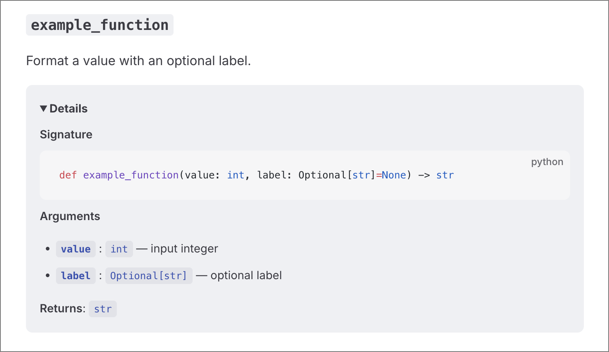

---
# https://vitepress.dev/reference/default-theme-home-page
layout: home

hero:
  text: "rdocgen"
  tagline: Markdown documentation generator from python source code
  actions:
    - theme: brand
      text: Get started
      link: /getting-started
    - theme: alt
      text: Single-file example
      link: /api/modules/rdocgen/example
    - theme: alt
      text: Project example
      link: /api

features:
  - title: Inline comments, no docstring drift
    details: Describe arguments and attributes where they are defined.
  - title: Type annotations become docs
    details: Render type hints alongside parameters and returns.
  - title: VitePress-ready Markdown
    details: Generates clean Markdown with stable anchors and sections.

---

::: details See how it looks 

:::